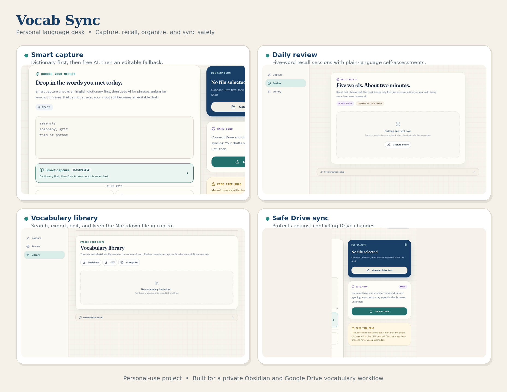

# Vocab Sync

> **Personal-use project.** Vocab Sync was built by Gautam for a private vocabulary workflow with Obsidian and Google Drive. It does not offer public sign-up, shared workspaces, or multi-user data isolation today.

Vocab Sync is a personal language desk for capturing new words, getting concise drafts, reviewing recall, and syncing an Obsidian-compatible `vocab.md` file safely to Google Drive.

**[Open Vocab Sync](https://bettercall-gautam.github.io/vocab-sync/)**



<p align="center"><em>Feature overview: Smart capture, daily review, vocabulary library, and safe Drive sync. All panels use placeholders or an unconnected state.</em></p>

## What it does

| Area | Current behavior |
| --- | --- |
| **Smart capture** | For an ordinary English word, it tries a public dictionary first. Phrases and dictionary misses use free-only AI when the owner has configured an OpenRouter key. If neither route can finish, the submitted text remains as an editable draft. |
| **Manual and Direct AI** | Manual creates an editable draft immediately. Direct AI skips dictionary lookup and uses only the configured free OpenRouter models. |
| **Review** | Five-word sessions use both word-to-meaning and meaning-to-word prompts, with plain-language self-assessments that schedule the next review. |
| **Library** | Search, filter, edit, or remove entries before syncing. Markdown and CSV export provide local backups. |
| **Safe Drive sync** | The selected Markdown file remains the source of truth. Before every write, Vocab Sync checks for external changes and blocks a conflicting sync. |
| **Installable app** | The site can be added to a phone or desktop home screen as a Progressive Web App with a standalone window and custom icon. |

The same Capture, Review, and Library workflow is responsive on phone, tablet, and desktop.

## Personal use today

This deployed version is designed around one private workflow. It connects to the owner’s Google Drive, opens Markdown notes from the owner’s configured folder, and has no public account registration.

> It is **not yet a public service for other users**. Do not treat the current deployment as a multi-user product or use it to store another person’s Drive credentials.

## Quick start

1. Open the [live app](https://bettercall-gautam.github.io/vocab-sync/) and choose **Connect Drive**.
2. Select a Markdown note from the allowed Drive folder. The note should use the three-column vocabulary table shown below.
3. In **Free browser setup**, optionally enter an OpenRouter key on a private, screen-locked device.
4. Paste one word, several lines, or comma-separated phrases. Choose **Smart capture**, **Manual**, or **Direct AI**.
5. Review and edit every draft. Select **Sync to Drive** only when the changes look right.

```md
| Word or Phrase | Simple Meaning | Example |
|---|---|---|
| hypothesis | A testable idea. | We tested the hypothesis. |
```

## Free use, privacy, and limits

| Service | Data and cost model |
| --- | --- |
| **Instant Dictionary** | Uses public dictionary sources for ordinary English words. It needs no OpenRouter key and does not consume the owner’s AI quota. |
| **Free AI** | Uses only the configured OpenRouter free-model route. The key stays in the browser, and free-model availability or daily limits are controlled by OpenRouter. Paid-model fallback is disabled. |
| **Google Drive** | The owner chooses the file. The app requests the selected-file Drive permission model and uses the Google Picker. [1] [2] |
| **Persistent connection** | A small Cloudflare Worker stores the owner’s encrypted Google refresh token and device-session data in D1 so the personal Drive connection can be restored safely. No vocabulary-file content is copied into the app database. |
| **Review progress** | Review scheduling metadata can sync between the owner’s devices through the protected Worker endpoint. The vocabulary note remains the source of truth for vocabulary entries. |

Never commit API keys, OAuth client secrets, `.env` files, or exported Drive credentials to GitHub. Use **Remember key** only on a personal device with a screen lock.

## Install on a home screen

On Android, open the app in Chrome and choose **Install app** or **Add to Home screen**. On iPhone, open it in Safari, choose **Share**, then choose **Add to Home Screen**.

The installed shortcut opens Vocab Sync quickly in an app-style window. It is not a native live widget that can show a word without opening the app.

## Architecture

| Layer | Role |
| --- | --- |
| GitHub Pages | Hosts the static React and Vite frontend. |
| Cloudflare Worker and D1 | Handles encrypted owner Drive credentials, opaque device sessions, and protected review-state sync. |
| Google Drive | Holds the selected Obsidian-compatible Markdown file. |
| OpenRouter | Optional, owner-managed free-only AI generation. |

## Future direction

The next major version may make Vocab Sync usable by other people. That work is **not built yet**. A safe public version would require separate accounts, one isolated Drive connection per user, strict authorization on every backend request, per-user review state, rate limiting, and a clear privacy policy.

Until then, this remains a personal project rather than a public software-as-a-service product.

## Development

Install Node.js and pnpm, then run:

```bash
pnpm install
pnpm dev
```

Run these checks before publishing a change:

```bash
pnpm check
pnpm test
pnpm build:static
```

The deployed frontend is hosted on GitHub Pages. Personal deployment values and user-specific folder configuration are intentionally not documented here. See the technical notes under [`docs/`](docs/) if you are maintaining this project.

## Further reading

Read the [user guide](docs/user-guide.md) for the normal capture and sync flow, the [PWA home-screen guide](docs/pwa-home-screen.md) for installation details, and the [technical notes](docs/) for implementation history.

## Licence

**All rights reserved.** This repository is personal-use software for now. No permission is granted to copy, modify, distribute, sublicense, or use it as a public service without the owner’s written permission. See [`LICENSE`](LICENSE).

## References

[1]: https://developers.google.com/workspace/drive/picker/guides/web-picker "Google Picker for web apps"
[2]: https://developers.google.com/workspace/drive/api/guides/api-specific-auth "Google Drive API authorization scopes"
